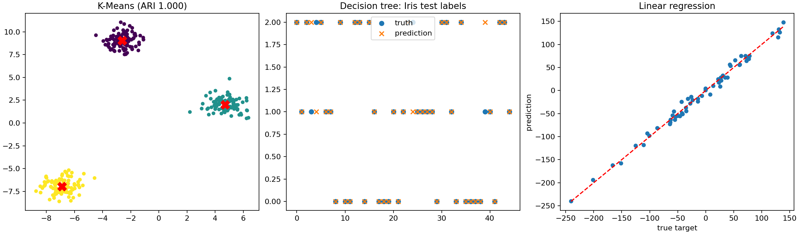

# ML-From-Scratch: Three-Algorithm Reproduction Suite

对 [`eriklindernoren/ML-From-Scratch`](https://github.com/eriklindernoren/ML-From-Scratch)
中此前选定的三个算法进行统一复现：K-Means、分类决策树和线性回归。上游固定在提交
[`a2806c6`](https://github.com/eriklindernoren/ML-From-Scratch/commit/a2806c6732eee8d27762edd6d864e0c179d8e9e8)。

## Results

| Algorithm | Dataset | Primary result | sklearn comparison |
|---|---|---:|---:|
| K-Means | 300 samples, 3 blobs | ARI **1.0000** | ARI 1.0000; inertia identical |
| Classification tree | Iris, 45 test samples | Accuracy **91.11%** | sklearn 93.33%; agreement 93.33% |
| Linear regression (gradient descent) | 240 samples, 3 features | R² **0.9898276483** | sklearn 0.9898276480 |



所有正式验收均通过，且完整实验重复运行两次后指标完全一致。

## Important upstream finding

上游 `LinearRegression(gradient_descent=False)` 的闭式 SVD 路径被忠实复现，但验证失败：

- 原版 SVD 路径：R² `-1.7929067204`
- 上游默认梯度下降路径：R² `0.9898276483`
- sklearn：R² `0.9898276480`
- 修正后的 SVD 诊断：R² `0.9898276480`

根因是 NumPy `np.linalg.svd` 返回 `(U, S, Vh)`，而上游将第三个返回值当作 `V`
直接用于 `V @ S⁺ @ U.T`。诊断修正将其改为 `Vh.T @ S⁺ @ U.T`，预测与 sklearn
最大差异降至 `8.53e-14`。正式的成功复现仍使用上游示例默认的梯度下降路径；修正仅作为根因证明。

## Run

```bash
python -m venv .venv
# Windows: .venv\Scripts\activate
# Linux/macOS: source .venv/bin/activate
python -m pip install -r requirements.txt
python run_all.py
```

Windows 用户也可以运行 `run.ps1`。

## Acceptance criteria

- K-Means ARI ≥ 0.95
- 分类决策树测试准确率 ≥ 0.90
- 线性回归 R² ≥ 0.95
- 梯度下降预测与 sklearn 最大差异 < `1e-4`
- 修正 SVD 预测与 sklearn 最大差异 < `1e-10`

## Files

- `algorithms.py`：三个从零实现算法
- `run_all.py`：固定数据、sklearn 对照、验收与绘图
- `results/metrics.json`：机器可读指标
- `results/experiment.log`：正式运行日志
- `results/all_algorithms.png`：三算法结果图

算法结构源自 ML-From-Scratch，Copyright (c) 2017 Erik Linder-Norén，MIT License。
